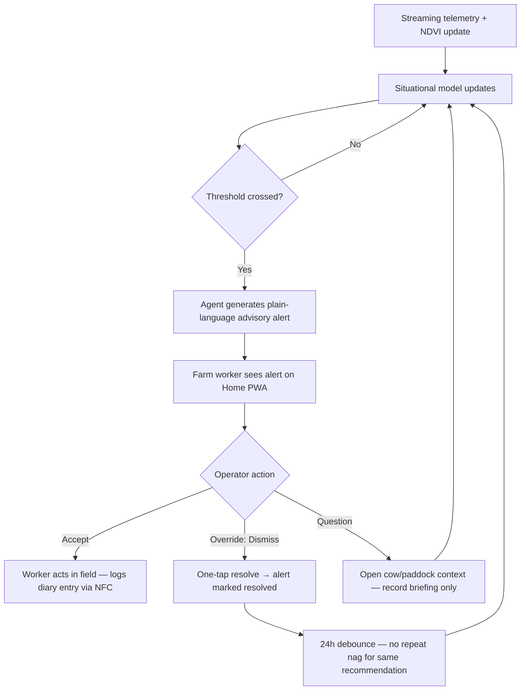
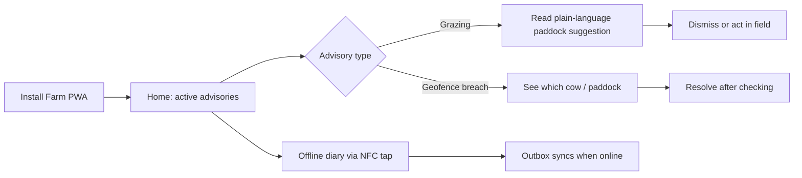

# LivestokOS — Cursor Hackathon Submission

**Track:** Agents in physical / operational environments  
**Inference:** [Crusoe Managed Inference](https://www.crusoe.ai/) via OpenAI-compatible API  
**Environment:** Pasture and zero-grazing **field sites** — not a dashboard product

This document maps LivestokOS to the official hackathon brief: build an agent that
constructs a **live situational model** from streaming inputs and drives
**proactive, context-sensitive actions** a non-technical operator can **trust,
question, and override** — with overrides feeding the next recommendation cycle.

---

## Hackathon brief alignment

> *Agents deployed in physical or operational environments must understand not just
> what is happening but **where, when, and relative to what else** is changing
> around them.*

LivestokOS is a **field-site operations agent** for livestock farms. It is
analogous to the festival crowd-flow agent or warehouse aisle-conflict agent —
applied to paddocks, collars, and herd movement instead of wristbands or forklifts.

| Brief requirement | LivestokOS implementation |
|-------------------|---------------------------|
| **Physical / operational environment** | Active pasture farm — collars, gateways, paddock geofences |
| **Streaming inputs** | LoRaWAN telemetry (Broadway ingest), geofence breach events, satellite NDVI jobs |
| **Where** | PostGIS geofences, collar GPS, paddock IDs, `cow_id` scope |
| **When** | Timestamped sensor readings, rotation events, alert debounce windows |
| **Relative to what** | NDVI vs other paddocks, days since last graze, grass recovery projections, herd centroid |
| **Live situational model** | Per-cow digital twin GenServers + paddock compliance scores + latest NDVI readings |
| **Proactive actions** | Plain-language alerts: paddock rotation, overgrazing risk, heat stress, geofence breach |
| **Non-technical operator** | Farm worker PWA — large tap targets, outdoor contrast, no jargon in alert copy |
| **Trust / question / override** | Alert shows score + source; **Dismiss / Resolve** one-tap; context briefing cites records |
| **Override → next cycle** | Resolved alerts stop repeat nags (24h debounce); confirmed patterns update similarity memory |
| **Crusoe Managed Inference** | `LLM_API_BASE_URL` → Crusoe OpenAI-compatible endpoint for advisory copy generation |

---

## 1. The operational problem

### Field-site pain (not a desktop analytics problem)

A relief worker walks **Paddock B** with no signal. The farm needs to know:

- **Where** is each cow relative to virtual fence boundaries?
- **When** did this paddock last rotate — and is grass recovery on track?
- **Relative to what** — should the herd move to Paddock C today based on NDVI vs the rest of the farm?

Today that knowledge is scattered across paper notes, WhatsApp, and spreadsheets.
By the time someone at the farmhouse sees a dashboard, the moment to act in the
field has passed.

### One-sentence problem statement

> Livestock field operations lack a **live situational model** and **proactive,
> overridable advisories** — workers react late because streaming collar, map,
> and satellite data never fuse into a single plain-language recommendation.

---

## 2. Live situational model (what the agent knows)

The agent does not wait for a human to query a database. It continuously fuses:

```text
Streaming inputs                    Situational model (always updating)
─────────────────                   ───────────────────────────────────
LoRaWAN collar readings      ──►    Digital twin per cow (CowProcess GenServer)
  · GPS, temperature, activity        · current behavioural state
                                      · debounced anomaly detection
Geofence polygon checks      ──►    Breach events + deterrent command queue
  · on every reading insert           · which cow, which paddock, when
Satellite NDVI jobs (Oban)   ──►    Paddock grass health + stale flags
  · per paddock, scheduled            · percentile vs rest of farm
Rotation events              ──►    Days-since-grazed matrix
  · herd centroid worker (6h)         · compliance scores per paddock
Weather / recovery jobs      ──►    Grass recovery projections
                                      · days-to-recovery, confidence
```

**Output:** a farm-scoped world state the agent reasons over when generating
the next advisory — not a static report.

---

## 3. Proactive advisories + one-tap override

This is the core hackathon interaction loop (mirrors festival crush-risk / warehouse aisle-conflict patterns):



### Example advisory (plain language)

> **Grazing suggestion:** Recommended paddock: "North Ridge" (score: 0.82, NDVI: 0.71)  
> `[Dismiss]` — one tap, no settings menu

Implemented in:

- `LivestokOs.AI.GrazingCoach` — deterministic paddock ranking (NDVI × rest × recovery)
- `LivestokOs.Operations.GrazingCoach` — heat-stress / overgrazing operational alerts
- `GrazingCoachCard` + `AlertCard` — field UI with **Dismiss / Resolve** buttons
- `useAlerts().resolve(id)` — `PATCH` alert → `is_resolved: true`

### Override feedback loop

| Override type | What happens next |
|---------------|-------------------|
| **Dismiss grazing advisory** | Alert resolved; backend debounces duplicate `GRAZING_RECOMMENDATION` for 24h |
| **Resolve geofence / health alert** | Removed from active inbox; twin continues monitoring for new conditions |
| **Confirm operational pattern** (optional) | Similarity memory updated for future context briefings — human confirmed, never auto-written |

---

## 4. Operator trust (not a black box)

The agent is designed so a **non-technical field worker** can trust but verify:

| Trust mechanism | Implementation |
|-----------------|----------------|
| **Plain language** | Alert `message` field — no raw JSON in the field UI |
| **Show the math** | Grazing score + NDVI visible in advisory copy |
| **Source attribution** | Context briefings tag cow records vs research vs similar confirmed patterns |
| **No silent automation** | Geofence deterrents queue commands — worker sees breach alert first |
| **Fail closed on AI outage** | Geofencing + ingest continue if LLM unavailable (fault-isolation tests) |
| **Non-diagnosis guardrail** | Context briefing explicitly does not diagnose — see compliance section |

---

## 5. Crusoe Managed Inference

LivestokOS uses a provider-agnostic LLM client (`LivestokOs.AI.LLMConfig`). Point
it at **Crusoe Managed Inference** by setting OpenAI-compatible env vars:

```bash
# backend/.env
LLM_API_KEY=<your-crusoe-api-key>
LLM_API_BASE_URL=<crusoe-managed-inference-openai-compatible-base>/v1
LLM_CHAT_MODEL=<model-slug-on-crusoe>
```

Crusoe is used for:

- Generating plain-language advisory copy when templated alerts need enrichment
- Optimization **proposals** (Markdown files for developer review — never auto-applied)
- Context briefing sessions (record summarisation — not diagnosis)

Deterministic hot paths (geofence math, paddock ranking weights, ingest pipeline)
run in **Elixir/OTP** without inference — Crusoe augments language layers only.

---

## 6. Primary user journey (field operator — not admin dashboard)



**Admin PWA** exists for cross-farm audit (carbon ledger, fleet) — it is **not**
the hackathon demo path. Judges should evaluate the **field operator loop** first.

---

## 7. What we built during the hackathon

LivestokOS had an Elixir umbrella backend before the event. The hackathon sprint
delivered the **field operator surface** and **documentation alignment**.

### Shipped during the hackathon

- **Farm PWA** — alert-centric home, GrazingCoachCard with Dismiss, offline diary, NFC/QR field ID
- **Proactive advisory UI** — AlertsInbox, severity/group visual language, one-tap resolve
- **Admin PWA** — secondary audit views (ledger, fleet) — not the primary feature
- **AI research & propose loop** — Oban workers; proposals are Markdown for human merge only
- **Crusoe-ready LLM config** — provider-agnostic `LLM_API_*` env vars
- **Documentation** — this file, root README, umbrella READMEs, MIT LICENSE

### Pre-existing foundation

- LoRaWAN Broadway ingest, digital twin GenServers, PostGIS geofencing
- Satellite NDVI jobs, carbon hash-chain ledger, Guardian JWT API

### 5-minute demo script (for judges)

1. Show **streaming ingest** path: LoRaWAN → twin → alert (architecture diagram)
2. Open **Farm PWA Home** — live advisories, not charts
3. Read a **Grazing suggestion** with NDVI score in plain language
4. Tap **Dismiss** — show alert resolved, inbox updated
5. Toggle **offline diary** + NFC cow tap — field operator workflow
6. Mention **Crusoe** env vars for inference layer
7. *(Optional, 30s)* Admin ledger — secondary audit tool only

---

## 8. Compliance — what this project is NOT

To stay clearly outside [banned hackathon categories](README.md#compliance--not-a-banned-project-type):

| Banned category | Why LivestokOS is different |
|-----------------|----------------------------|
| **Medical advice bot** | No diagnosis, no prescriptions. Context briefing **summarises existing records** for a licensed professional; UI and prompts enforce non-diagnosis. Primary feature is **operational advisories** (paddock, geofence, heat). |
| **Basic RAG application** | Retrieval augments briefings only. Core agent = **streaming situational model + proactive alerts + override loop**. pgvector is one input to context, not the product. |
| **Dashboard as main feature** | Farm PWA leads with **actionable alert cards**, not charts. Admin views are audit secondary. |
| **Sports analyzer / coach** | GrazingCoach is **pasture rotation operations** (NDVI + rest days) — analogous to warehouse aisle routing, not athletic coaching. |
| **Nutrition coach** | Feed logging is operational record-keeping; no meal plans or diet advice. |
| **Mental health advisor** | Not applicable — operational livestock platform. |
| **Image analyzer** | QR scan identifies device serials only; no ML vision classification of animals. |
| **Streamlit app** | React PWAs + Phoenix API. |

All code is original or standard open-source dependencies (MIT/Apache). No
scraped datasets or unlicensed assets ship with the repo.

---

## 9. Links

- [Root README](README.md) — product overview, quick start, roadmap
- [Backend README](backend/README.md) — OTP umbrella, ingest → twin → alert pipeline
- [Frontend ARCHITECTURE](frontend/ARCHITECTURE.md) — field-first PWA decisions
- [livestok_os_ai README](backend/apps/livestok_os_ai/README.md) — inference + advisory layer
- [LICENSE](LICENSE) — MIT, provided as-is
